# Daily To-do App
Final Android Project

# About the App
The to-do-app is an app where a user can add their daily task or list of thing to be done. The user needs to first register in order to sign in. The user can add, edit and delete their to-do list. The app has two different type of to-do which are with orm and without the orm.

# Feature available in to-do app 

1. Two types of to-do app with ORM and without ORM
2. Splash Screen
3. Login and sign-in with validators
4. User dashboard for navigation
5. App information i.e. About and fragments activity for details
6. Crud method in the to-do app without orm
7. Add to-do list 
8. Edit to-do list
9. Delete the to-do list
10. MVVM to-do without ORM
11. MVVM to-do with ORM
12. Use of layouts like linew, coordinator and relative
13. Use of recycle views, list view
14. Date picker
15. Complete/ not complete status with background color
16. Prioty of the to-do list can be set from 1 to 5
17. The to-do app is user friendly
18.Date can be set by current date and display of current date
19. The to-do list of orm can be done by swiping any list from left/right or all the list can be deleted   at ones
20. Different toast message and alert dialog box
21. Logout feature of user

# Screenshots of TodoApp
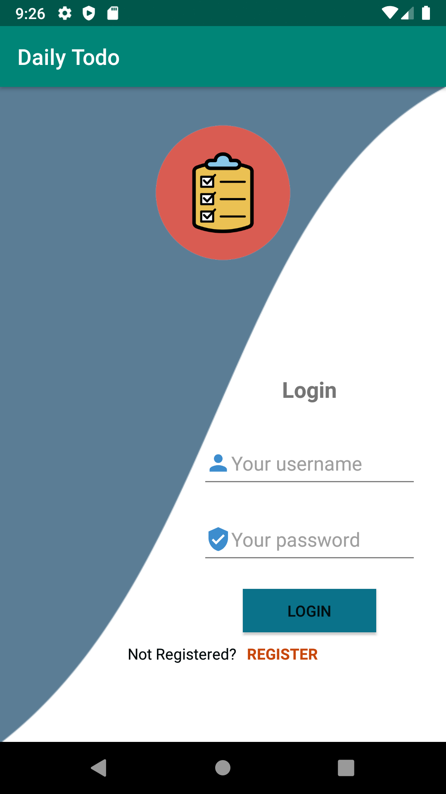
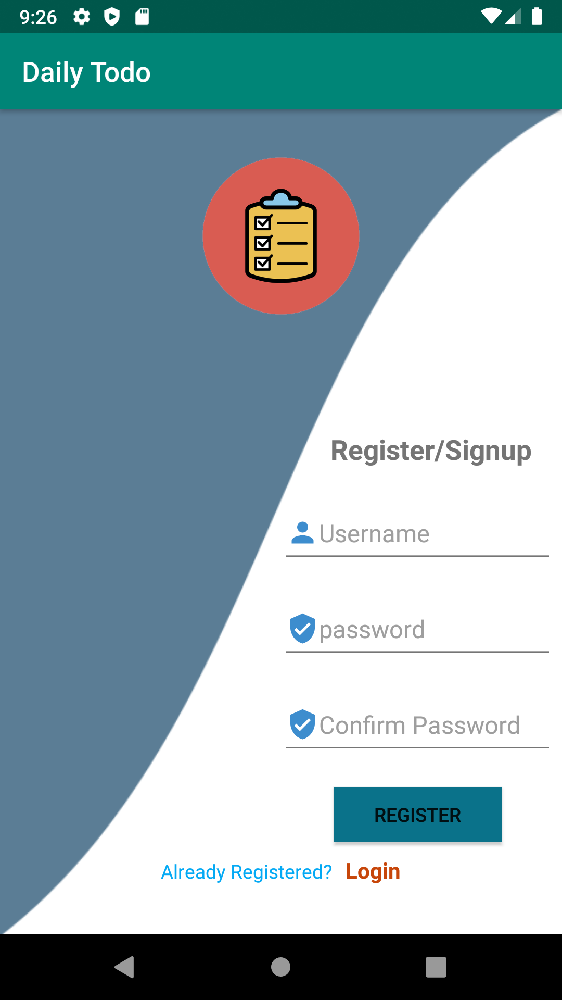
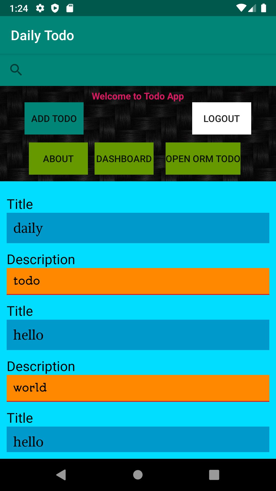
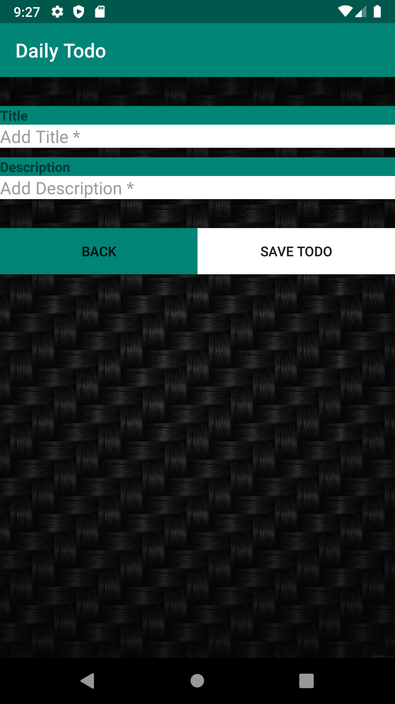
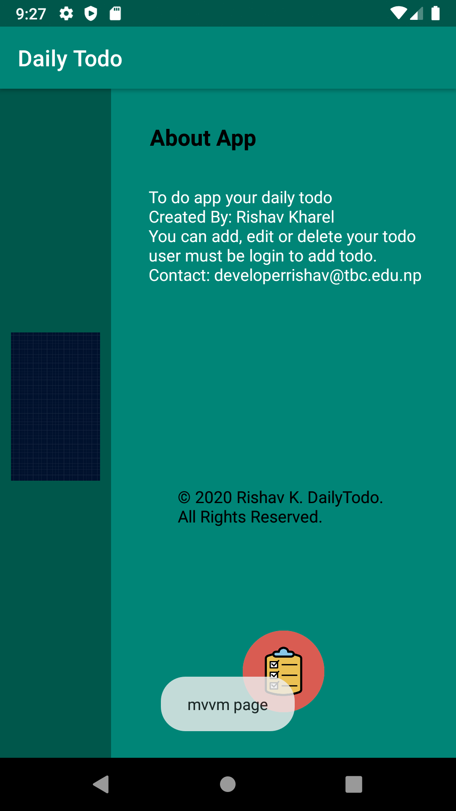
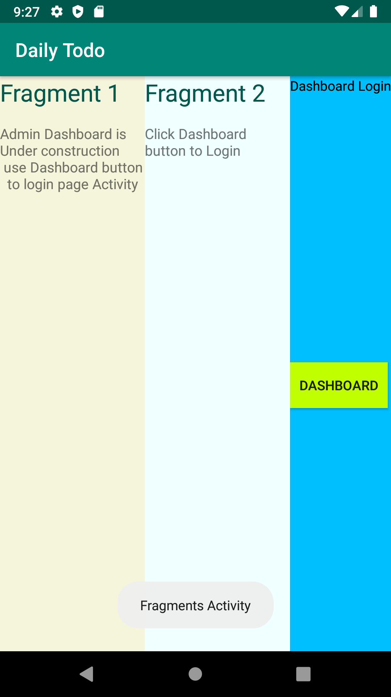
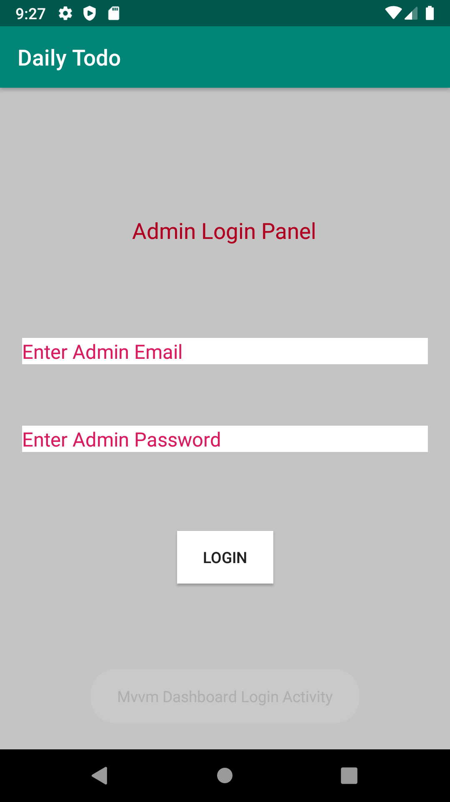

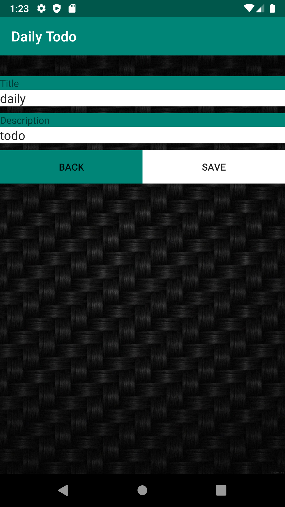
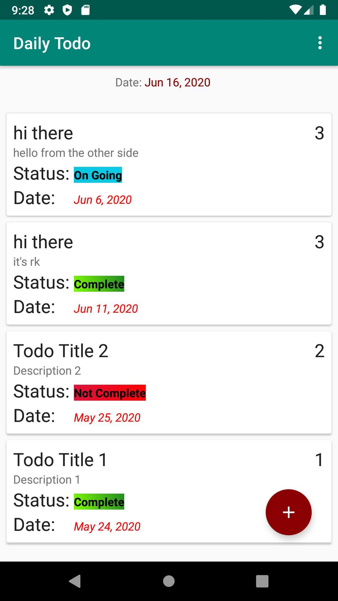

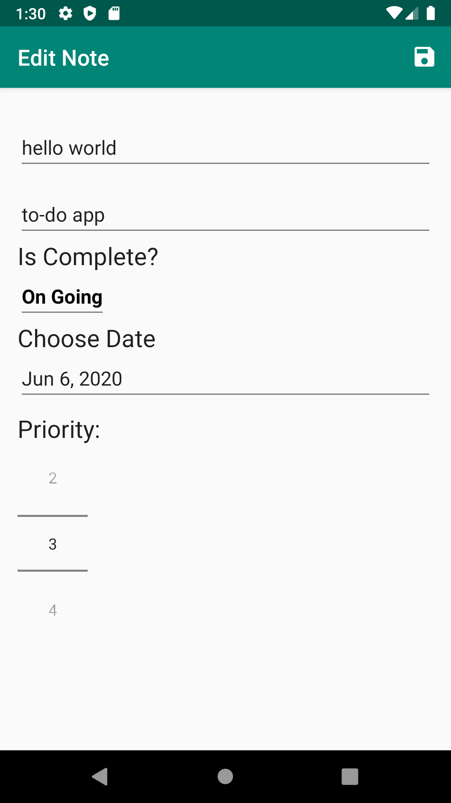
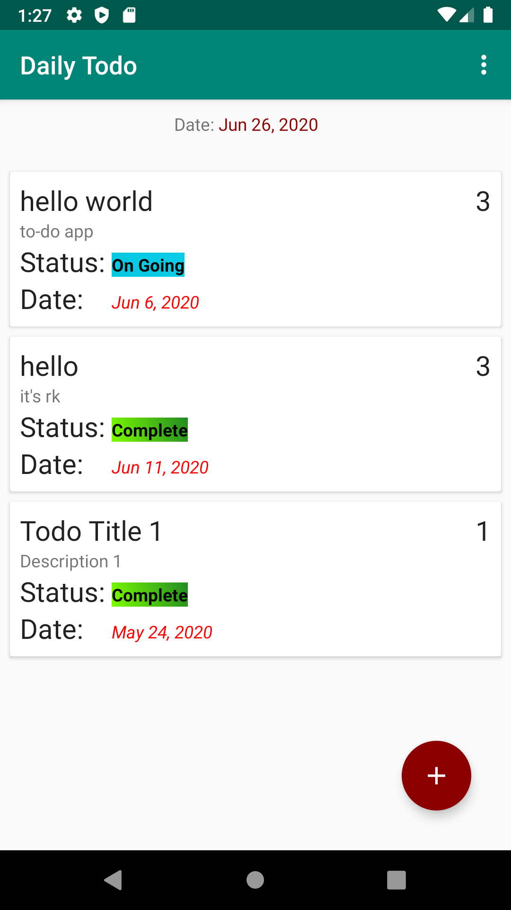

